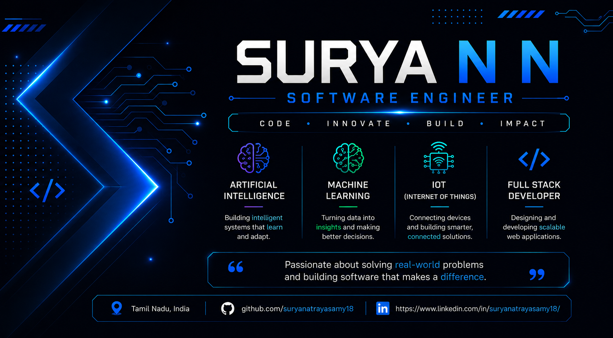

  

<h1 align="center">Hi 👋, I'm Surya N N</h1>

  

## 👨‍💻 About Me

- 🎓 Final-Year Electronics & Communication Engineering Student
- 🏫 V.S.B. Engineering College
- 🌱 Currently learning **Java, Spring Boot, AI, Machine Learning, IoT**
- 💡 Passionate about Software Development and Real-World Problem Solving
- ☁ Google Cloud Learner
- 📫 Reach me: **your email**

## 🛠 Tech Stack

## 📊 GitHub Stats

## 🚀 Featured Projects

- 🌾 Smart Crop Monitoring System
- 📱 Spam SMS Detection
- 🤖 AI Projects
- ☁ Google Cloud Labs
- ☕ Java Projects

- ## 🏆 Certifications

✔ Google Cloud Foundations

✔ Cisco Cybersecurity

✔ Principles of Generative AI

✔ NPTEL

✔ Infosys Springboard
## 🌐 Connect with Me

